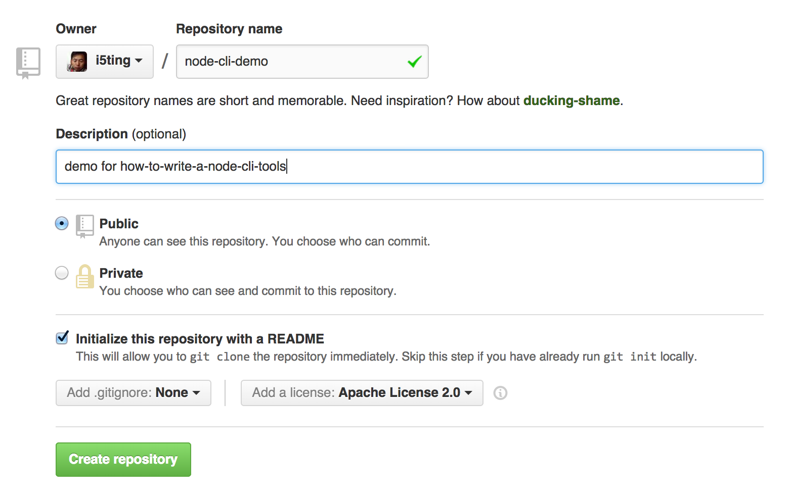

how-to-write-a-node-cli-tools-with-commander
============================================

[视频](https://raw.githubusercontent.com/nodeonly/how-to-write-a-node-cli-tools-with-commander/master/how-to-write-a-node-cli-tools-with-commander.mov)

## 什么是cli tools？

CLI（command-line interface，命令行界面）是指可在用户提示符下键入可执行指令的界面。

早启的unix/linux和DOS都是没有可视化界面的，那内存靠计算着用的时代都只能玩玩命令。

## node cli

好处

- 现在火，前端以及服务器端必备技能
- js语法，非常好写
- 对版本要求不像ruby那样苛刻

缺点，暂未知，看以后node的路吧

## 做法

### 创建git repo



### git clone到本地

	git clone git@github.com:i5ting/node-cli-demo.git
	
###  切换到项目目录

	cd node-cli-demo

### 初始化npm

执行

```
npm init
```

一直回车，除非你真的有东西想改动，具体如下

```
➜  node-cli-demo git:(master) npm init
This utility will walk you through creating a package.json file.
It only covers the most common items, and tries to guess sane defaults.

See `npm help json` for definitive documentation on these fields
and exactly what they do.

Use `npm install <pkg> --save` afterwards to install a package and
save it as a dependency in the package.json file.

Press ^C at any time to quit.
name: (node-cli-demo) 
version: (1.0.0) 
description: 
entry point: (index.js) 
test command: 
git repository: (https://github.com/i5ting/node-cli-demo.git) 
keywords: 
author: 
license: (ISC) 
About to write to /Users/sang/workspace/github/node-cli-demo/package.json:

{
  "name": "node-cli-demo",
  "version": "1.0.0",
  "description": "node-cli-demo =============",
  "main": "index.js",
  "scripts": {
    "test": "echo \"Error: no test specified\" && exit 1"
  },
  "repository": {
    "type": "git",
    "url": "https://github.com/i5ting/node-cli-demo.git"
  },
  "author": "",
  "license": "ISC",
  "bugs": {
    "url": "https://github.com/i5ting/node-cli-demo/issues"
  },
  "homepage": "https://github.com/i5ting/node-cli-demo"
}


Is this ok? (yes) 
➜  node-cli-demo git:(master) ✗ 
```

### 创建文件

	mkdir bin
	mkdir test

	touch bin/node-cli-demo.js
	touch test/node-cli-demo.js

	touch index.js
	touch gulpfile.js

### 修改package.json

#### 命令配置（至关重要）

```
  "preferGlobal": "true",
  "bin": {
    "badge": "bin/badge.js"
  },
```

此处是关键

`preferGlobal`确定你的这个命令是不是全局的，一定要设置为true，不然不放到path里，不能全局用的。


`bin`是配置你的cli名称和具体哪个文件来执行这个的

#### 依赖

```
  "devDependencies": {
    "chai": "^1.9.2",
    "gulp": "^3.8.10",
    "gulp-istanbul": "^0.3.1",
    "gulp-mocha": "^1.1.1",
    "istanbul": "^0.3.2",
    "mocha": "^2.0.1",
    "sinon": "^1.11.1",
    "supertest": "^0.14.0",
    "supervisor": "^0.6.0",
    "zombie": "^2.1.1"
  },
  "dependencies": {
    "commander": "^2.5.0",
		"config": "^1.7.0",
    "handlebars": "^2.0.0",
    "request": "^2.47.0"
  },
```

----------
当前npm依赖dependencies

- commander （命令辅助lib）
- config （配置项）
- handlebars （模板操作）
- request （http请求库）

如果这些不够的话

	npm install --save xxx

----------

开发阶段的依赖devDependencies

- mocha（测试相关）
- gulp （项目构建相关的）

如果这些不够的话

	npm install --save-dev xxx
	
#### scripts

```
  "scripts": {
    "start": "npm publish .",
    "test": " node bin/badge.js -t js -n q "
  },
```

这里定义了2个命令

- `npm start`

这里我用它发布当前npm到npmjs.org上

- `npm test`

这里我用它作为测试代码，避免每次都重复输入

## 修改 bin/node-cli-demo.js


```
	#!/usr/bin/env node
	/**
	 * Module dependencies.
	 */
	function isDefined(x) { return x !== null && x !== undefined; } 
	Array.prototype.contain = function(obj) {
	  return this.indexOf(obj) !== -1;
	}

	var program = require('commander');
	var version = require("../package.json").version;

	program
	  .version(version)
		.usage(" badge -n badge-cli -f [md] -t [npm] ")
		.option('-n, --name [name]', 'npm name,for example: q')
	  .option('-f, --format [format]', '可选值：url, markdown（默认值）, html, textile, rdoc, asciidoc, rst')
	  .option('-t, --type [type]', '可选值：npm（默认值）, ruby    , python    , bower    , github    , nuget    , php    , cocoapods    , perl  ')
		.option('-v, --verbose', '打印详细日志')
	  .parse(process.argv);

	var module_name = '';
	if(isDefined(program.name) == true && typeof program.name == 'string' ){
		module_name = program.name;
	}else{
		console.log('没有知道模块名称，请重新输入,比如\n\t badge -n badge-cli -f [md] -t [npm] ');
		return;
	}

	var format = "markdown";
	var type = "js";

	if (program.format) {
		format = program.format;
	}

	if (program.type) {
		type = program.type;
	}

	var verbose = false;
	if (program.verbose) {
		verbose = program.verbose;
	}

	var FORMATS = ['url', 'markdown', 'html', 'textile', 'rdoc', 'asciidoc', 'rst']

	if (FORMATS.contain(format) == false) {
		console.log('-f 可选值：url, markdown（默认值）, html, textile, rdoc, asciidoc, rst');
		return;
	}

	var _verbose = verbose;
	function log(str){
		if(_verbose == true){
			console.log(str);
		}
	}

	log('format = ' + format);
	log('type = ' + type);
	log('name = ' + module_name);
	log('verbose = ' + verbose);

	// main 
	// require('../index')(module_name, type, format, verbose);
```

注意

- shabang用法


```
	#!/usr/bin/env node
```

- commander用法

```
	var program = require('commander');
	var version = require("../package.json").version;

	program
	  .version(version)
		.usage(" badge -n badge-cli -f [md] -t [npm] ")
		.option('-n, --name [name]', 'npm name,for example: q')
	  .option('-f, --format [format]', '可选值：url, markdown（默认值）, html, textile, rdoc, asciidoc, rst')
	  .option('-t, --type [type]', '可选值：npm（默认值）, ruby    , python    , bower    , github    , nuget    , php    , cocoapods    , perl  ')
		.option('-v, --verbose', '打印详细日志')
	  .parse(process.argv);
```

还是比较简单的

- 参数的默认值

```
	var module_name = '';
	if(isDefined(program.name) == true && typeof program.name == 'string' ){
		module_name = program.name;
	}else{
		console.log('没有知道模块名称，请重新输入,比如\n\t badge -n badge-cli -f [md] -t [npm] ');
		return;
	}
```

- 主文件

```
	// main 
  require('../index')(module_name, type, format, verbose);
```

注意主文件参数按需求定义

## 编写index.js

```
module.exports = function (module_name, type, format,verbose) {
	console.log('i am main file for cli');
}
```


## 编写test/node-cli-demo.js

```
var assert = require('chai').assert;
var expect = require('chai').expect;
require('chai').should();

describe('Node-cli-demo', function(){
	before(function() {
    // runs before all tests in this block
  })
  after(function(){
    // runs after all tests in this block
  })
  beforeEach(function(){
    // runs before each test in this block
  })
  afterEach(function(){
    // runs after each test in this block
  })
	
  describe('#save()', function(){
    it('should return test2 when user save', function(){
			assert.equal(1, 1);
    })
  })
})
```
## 增加自动测试和代码覆盖率

修改gulpfile.js

```
	var gulp = require('gulp');
	var istanbul = require('gulp-istanbul');
	var mocha = require('gulp-mocha'); 

	gulp.task('test', function (cb) {
	  gulp.src(['db/**/*.js'])
	    .pipe(istanbul()) // Covering files
	    .on('finish', function () {
	      gulp.src(['test/*.js'])
	        .pipe(mocha({
						ui : 'bdd',
						reporter: 'spec'
					}))
	        .pipe(istanbul.writeReports()) // Creating the reports after tests runned
	        .on('end', cb);
	    });
	});

	gulp.task('default',['test'], function() {
	  gulp.watch(['./db/**/*','./test/**/*'], ['test']);
	});

	gulp.task('watch',['test'], function() {
	  gulp.watch(['./db/**/*','./test/**/*'], ['test']);
	});
```

注意自己修改目录

- src目录
- 测试目录


## 测试

	node_modules/.bin/gulp 
	
这时，你试试修改测试或源文件试试，看看会不会自动触发测试

当然，如果你喜欢只是测试一次，可以这样做

	node_modules/.bin/gulp test 
	
如果你不熟悉gulp，可以再这里https://github.com/i5ting/js-tools-best-practice/blob/master/doc/Gulp.md学习


## 发布

	npm start
	
## 技术

- https://github.com/tj/commander.js(命令行)
- https://github.com/request/request（http请求）
- https://github.com/mochajs/mocha(测试)
- https://github.com/wycats/handlebars.js（模板）
- https://github.com/lorenwest/node-config (配置)

cli参考

- https://github.com/substack/node-optimist

## Contributing

1. Fork it
2. Create your feature branch (`git checkout -b my-new-feature`)
3. Commit your changes (`git commit -am 'Add some feature'`)
4. Push to the branch (`git push origin my-new-feature`)
5. Create new Pull Request

## 推荐

- [mac-dev-setup](http://aaaaaashu.gitbooks.io/mac-dev-setup/content/index.html)
- [How To Build A CLI Tool With Node.js And PhantomJS](http://www.smashingmagazine.com/2014/02/12/build-cli-tool-nodejs-phantomjs/)

## 版本历史

- v0.1.0 初始化版本

## 欢迎fork和反馈

- write by `i5ting` shiren1118@126.com

如有建议或意见，请在issue提问或邮件

## License

this repo is released under the [MIT
License](http://www.opensource.org/licenses/MIT).
